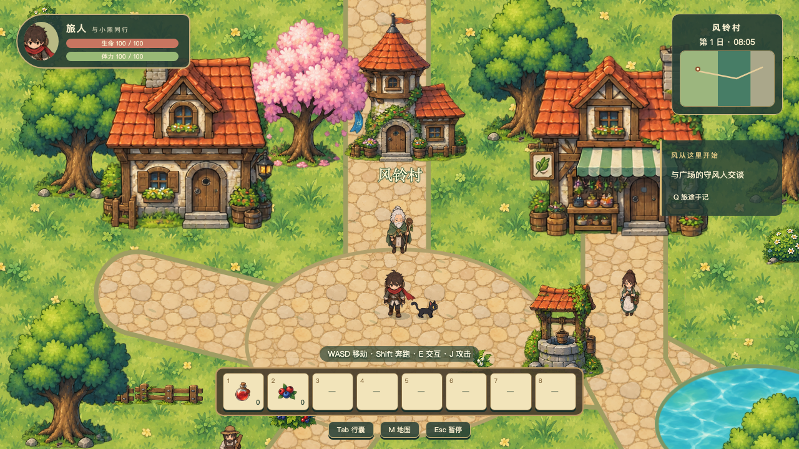
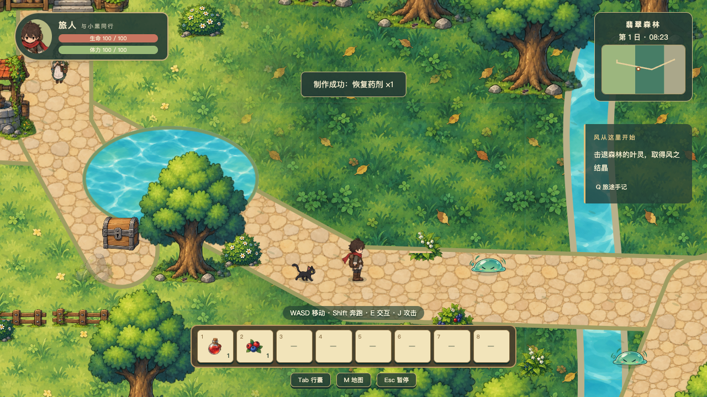

# 远风之地 · Farwind

**一款手绘动画风的二维俯视单人探索冒险游戏，在桌面浏览器中与一只黑猫同行。**

你是一位背着行囊、系着红围巾的旅行者。旅程从温暖的风铃村开始：听居民讲述森林中的异响，收集旅途补给，循着风的线索穿过林间小溪，寻找沉寂遗迹中的风之路标。



## 游戏档案

| 项目 | 内容 |
| --- | --- |
| 类型 | 探索冒险、轻动作战斗、资源采集与机关解谜 |
| 视角与美术 | 固定二维俯视视角，清新手绘动画风 |
| 游玩方式 | 单人，桌面浏览器，键盘与鼠标 |
| 语言 | 简体中文 |
| 当前版本 | 0.1.0，可玩的首版冒险切片 |
| 技术 | TypeScript、Phaser 4、Vite、WebGL |

## 旅途中有什么

- **三片相连的区域**：在风铃村休整，走进翡翠森林边缘，探索风之遗迹；通过道路步行往返。
- **一位黑猫伙伴**：跟随旅行者穿过村庄与森林，配有独立移动和待机动作。
- **完整主线与支线**：拜访守风人、调查异响、制作药剂、探索遗迹、修复路标，最后返回村庄领取奖励；另有采集支线与隐藏宝箱。
- **轻量战斗**：挥剑迎战史莱姆与叶灵，管理生命和奔跑体力。死亡后回到安全点，保留背包与任务。
- **采集与制作**：收集木材、石材、药草和浆果，使用24格行囊与8格快捷栏准备补给。
- **会留下变化的世界**：宝箱、机关、路标与捷径状态随存档保留；世界时间带来昼夜色调变化。



## 本地开始冒险

推荐使用已实测的 **Node.js 26 + npm**。不需要后端、账号或在线业务接口。

```sh
git clone git@github.com:caizh1/flow_wind.git
cd flow_wind/farwind
npm ci
npm run dev
```

在桌面浏览器打开终端给出的地址，通常为 **http://127.0.0.1:5173/**。请通过 HTTP 服务运行，不要直接双击 HTML 文件。

### 操作

| 按键 | 操作 |
| --- | --- |
| WASD / 方向键 | 移动 |
| Shift | 奔跑 |
| E | 对话、采集、开启宝箱与操作机关 |
| J / 鼠标左键 | 近战攻击 |
| Tab | 行囊与制作 |
| 1～8 | 使用快捷栏物品 |
| M / Q | 地图 / 任务 |
| Esc | 暂停与设置 |

初次进入村庄，可以先沿路向北寻找守风人。任务追踪会提示下一步目标。

## 存档与备份

游戏使用浏览器 **IndexedDB** 保存进度，支持安全节点自动保存、手动保存及 JSON 文件导入／导出。暂停菜单中可以管理存档、调整音量和切换全屏。

**清理浏览器站点数据可能删除存档，请定期导出到本地文件备份。** 不同浏览器或不同端口的存档不会自动共享，可通过导出／导入迁移。

## 开发与验证

以下命令均在 `farwind/` 中运行：

```sh
npm run typecheck
npm run test
npx playwright install chromium
npm run test:e2e
npm run build
npm run preview
```

构建结果位于 `farwind/dist/`。静态托管时将该目录的完整内容放到站点根目录；仓库本身不包含公开部署。`preview` 默认使用4173端口，与开发服务的存档来源不同。

当前记录包含19项逻辑／资源测试与5项浏览器测试通过，覆盖冒险闭环、存档恢复、移动动画和基本交互。测试结论、画面验收和设备性能分别记录，不能互相替代。

### 项目结构

```text
farwind/
  src/data/          # 物品、世界与动画定义
  src/game/          # 场景、实体、系统与界面
  public/assets/     # 游戏素材与资源清单
  tests/             # Vitest 与 Playwright 测试
  tools/             # 素材处理与录制工具
  docs/              # 进度、验证记录、截图与动画对照
```

- [工程说明与冒险路线](farwind/README.md)
- [当前进度与明确边界](farwind/docs/STATUS.md)
- [测试记录](farwind/docs/TEST-REPORT.md)
- [第二轮动画修复报告](farwind/docs/animation/ROUND-TWO.md)
- [素材登记](farwind/public/assets/manifest.json)

启动开发服务后，访问 `/docs/animation/index.html` 可查看实际运行录屏、动作循环和接触表；`/animation-preview.html` 提供开发用动作预览。

## 当前边界

这是持续完善中的冒险切片，并非整片大陆的最终成品。10～20分钟是内容设计目标，尚未完成首次玩家时长验证。当前四方向待机与行走、独立侧向奔跑已接入；竖向奔跑仍复用对应方向行走。部分动作美术仍可继续打磨。

目前提供合成音效，尚无背景音乐；不承诺移动端触屏适配或完全断网首次启动，尚未加入离线资源缓存。

## 素材与许可说明

素材来源、生成情况、尺寸和动画配置记录于资源清单。生成素材尚未完成商业权利审查，本仓库未授予统一的开源或商业使用许可；发布到代码仓库不代表所有素材可自由商用。
