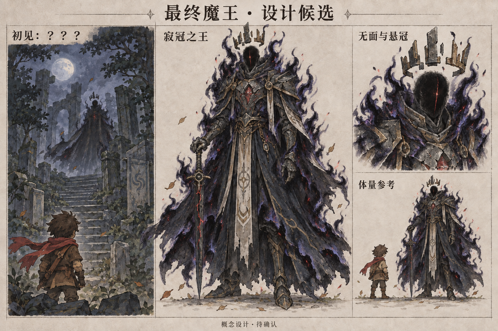

# 最终魔王设计候选：寂冠之王

状态：用户已确认第二版黑焰造型；叙事按用户提供的「捕猎、生存与逐渐敌对」方向更新。恶意与派遣逻辑已接入，首次增强为原编队增加五只；实际魔王素材仍待制作验收。验证进度见 [逻辑验收报告](validation.md)。

已采用第二版：在原造型上增加身体持续燃烧的黑色火焰。[第一版概念图](demon-king-concept.png) 保留供对照。后续规则见 [恶意值与袭村机制规划](malice-mechanism-plan.md)。

## 核心印象

一个维护魔物族群生存秩序的古老君王。它最初承认人类的生存资格，将捕猎和反抗视为自然竞争；当人类不断清剿巢域，它逐渐从戒备走向集体报复，最终成为村庄必须面对的魔王。

它很少说话，始终保持平静的威严。玩家先感到被注视，后来才理解它在失去什么，以及它为何选择战争。完整角色设定见 [寂冠之王的信念与转变](lore.md)。

设计称号暂定为「寂冠之王」。这不是开场向玩家公开的名字；首次现身时，角色名、对话名和遭遇标题统一显示「？？？」。真名暂不确定，留给后续故事揭晓。

## 外形

| 部位 | 设计 |
|---|---|
| 轮廓 | 修长、庄严、略微悬浮，含王冠可见高度约为主角的两倍半。体量是设计建议。 |
| 脸 | 没有眼睛和嘴的黑色空面，深处只有一条极细暗红裂纹。初见时连这条裂纹也隐藏在阴影中。 |
| 王冠 | 黑石与古铜组成的破损冠环，悬在头顶，与头分离；七枚短尖片构成醒目轮廓。 |
| 衣甲 | 风蚀青黑石甲、古铜线与灰白旧封印。墨青长袍下缘分为三条大布片，保证缩小后的辨认。 |
| 胸口 | 一枚破裂的暗红风之结晶，像仍在呼吸的封印。它是魔王及其直属部下共享的视觉印记。 |
| 黑焰 | 肩甲、双臂、腰侧及披袍边缘持续燃烧近黑火焰；以冷灰蓝与暗紫的薄边光辨认火舌，夹少量暗红火星。保留脸、冠、胸口和王剑的清晰轮廓。 |
| 武器 | 一柄向下垂落的缺刃王剑，青黑剑身内有细红裂纹。待机时不用大幅挥舞表现威胁。 |
| 配色 | 墨青、风蚀灰、旧古铜；暗红只用于少量裂纹与结晶。继承现有手绘描边和柔和材质。 |

压迫感来自沉静姿态、空面、悬冠、身体黑焰和异常的风。缩小后仍需清楚看见冠、肩、剑与袍的轮廓。

## 世界观提案

它是魔物领域的古老守护者与统治者，最初允许人类建村、狩猎，也允许人类在遭到捕猎时反击。在它看来，魔物觅食与人类猎兔都来自生存需要。它的具体身世保留悬念。

人类眼中的魔族据点，在魔王眼中是狩猎领地、巢群聚居地与迁徙节点。村民清剿它们以恢复安全，魔王却不断感到自己的族群正失去生存空间。恶意值记录它由容忍、戒备到报复、全面敌对的转变。

它的危险来自逐渐把具体的人类行为归罪于整个人类，以族群存续为理由发动集体报复。人类的防卫理由与魔物的生存需要都真实存在；后期王令的伤害与责任由魔王承担。

黑焰是其领域力量的表现，平静时缓慢流动，仇恨加深后愈发剧烈。胸口裂晶承载它与巢域的联系。

魔王与首张地图中的失控遗迹守卫分别承担全游戏终局和地区首领的角色。最终魔王的出现可为以后扩展大陆留下线索。

## 首次现身

建议在第一次清剿魔族据点后，以短暂的远景投影建立联系：周围风铃停响，飘动的树叶缓慢落下，遗迹石阶或林间深处出现一枚悬冠与模糊王袍。

名称显示「？？？」；台词只给一句：

> 这片土地，也有它们活下去的位置。

投影消失后，留下一块带同样细红裂纹的结晶。玩家可以继续探索，先建立「自己的清剿被另一位守护者视作族群损失」的疑问。首次现身以警告为主，持续清剿后逐步升级为有组织的报复。

初见不展示完整身体、真名、来历或战斗阶段。完整造型只在本次设计稿中供用户确认。

## 后续辨认线索

- 部分直属魔物身上逐步出现同源的裂晶印记、古铜碎片与断冠纹样。
- 魔王发出的声音很低、很近，视觉投影却很远；环境短暂失去风声。
- 传闻可先用「无风处的王」「戴着空冠的影子」等称呼，直到玩家获得可靠线索再揭晓称号。
- 精英强化的视觉方向是更完整的裂晶、封印和仪式装备。具体敌人、美术与等级规则留到机制规划阶段。

## 最终战的角色方向

「以王剑近战和风场控制压迫旅人」作为后续战斗气质。起初动作克制、每一下有明确意图；封印破裂后露出更多真实形体与力量。

伤害、数量、招式、阶段阈值与胜负条件在本次设计中不冻结。

## 已收到的机制要求

- 每清剿一个魔族据点，魔王对人类的恶意值加一。
- 首次达到一点时，在原编队上增加五只；之后每十点提高一个档次。
- 后续同时提升派遣魔物的精英等级，不能长期只增加数量。
- 魔王黑焰造型已经确认，恶意值与袭村机制规划已完成。

具体档位边界、清剿计数与安全约束已写入 [机制说明](malice-mechanism-plan.md)。逻辑、首档真实派遣和保存重开已验证；十点以上使用固定基准验证，见 [验收报告](validation.md)。

## 设计参考与交付

本稿查阅了当前游戏说明、首张地图规划和以下实际素材：

- 现有主角、史莱姆、叶灵与森林村庄对照：`../enemy-design-v2/references/visual-baseline.png`。
- 四种敌人的材质、描边与比例：`../enemy-design-v2/boards/overview.png`。
- 村庄夜间画面：`../enemy-design-v2/references/village-night.webp`。

当前概念图已保存为同目录的 [黑焰加强版设计板](demon-king-black-flame-v2.png)，[第一版设计板](demon-king-concept.png) 保留，实际中文生图输入见 [生成记录](generation-prompts.md)。两版均使用内置图像生成工具；第二版以第一版为唯一编辑输入。

已查看生成结果：远景剪影、无面、悬冠、裂晶、王剑与主角体量对照均可辨认，中文主标题与概念候选标记可读。图中采用放大的手绘设定表现，正式俯视角色的细节简化、游戏中的明暗和遮挡尚待设计确认后验证。

已查看第二版：全身、半身特写与比例对照中有连续黑焰，主体造型和中文标题保留；首次现身远景维持克制表现。身体黑焰已用于概念表现，尚未制作游戏动画或接入实际场景。

黑焰造型已获用户确认。游戏已经接入恶意机制、未知名称和文字初见；角色素材、黑焰动画与最终战仍待制作。概念画面不能作为实际运行、美术最终验收或性能证据。
