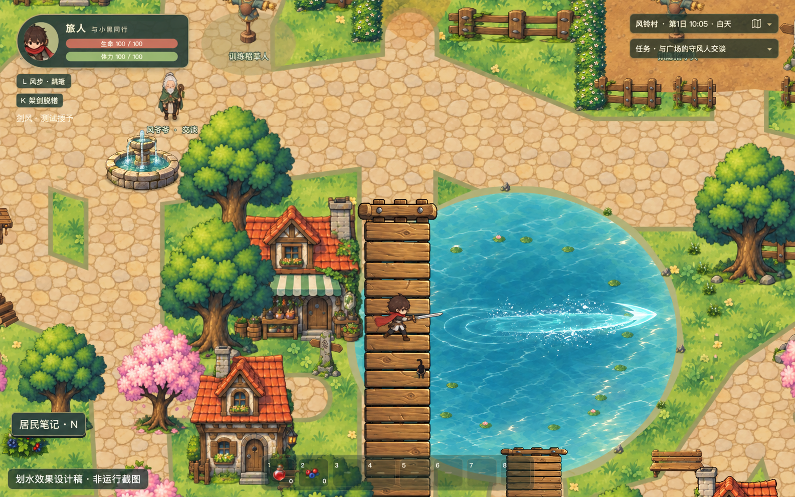

# 五阶段剑风实施记录

本轮实现一线斩、双穿、贯通、疾风斩与三向疾风斩。学习来自五个独特世界事件，不增加经验、技能点或成长货币。

## 划水设计

此图为先于运行实现生成的设计参考，不是游戏运行截图。目标是窄浪痕、两侧细水花与渐淡涟漪；水迹局限在真实水域，桥与岸地不出现水花。

## 原型参数

前三级距离300、宽28；后两级距离420、宽64；三向偏角为左30度、正前和右30度。基础伤害36，速度900，动作时序沿用现有配置。数值尚未完成平衡验收。

## 正式学习路线

所有入口由固定教本或装置提供，全天可用，不依赖居民存活、材料或主线进度。到教本或装置附近按E阅读；战斗仍用J／左键三连斩后接第四击。坐标用于复核场景布置，不在玩家界面展示。

| 本领 | 学习入口 | 完成事实 | 应用场景 |
| --- | --- | --- | --- |
| 一线斩 | 临水草坡教本，1380／1500；铺垫1310／1400 | 限定试用，朝北以第四击触动隔水风铃 | 右侧1430／1450再次送风，使用已正式掌握的能力 |
| 双穿 | 森林串铃，2460／900 | 将旁路导流至两铃之间，依靠自然风完成 | 2460／980朝东，两枚投影先后受击 |
| 贯通 | 森林长风道，2920／830 | 封闭唯一裂开的泄口 | 2890／1180朝东，三枚投影受击；石障后的第四枚保持不受击 |
| 疾风斩 | 遗迹扩流，3610／1175；铺垫3610／1110 | 限定宽幅试用，一次触动3574、3646／670两枚远铃 | 远铃同时处于旧窄刃覆盖与旧行程之外；3700／1150朝北的窄道允许窄剑风通过，截断宽幅疾风 |
| 三向疾风斩 | 分流庭，3910／1095；铺垫3910／1050 | 将左闸导向左前、右闸导向右前，中央天然风道保持连通 | 三条独立弹道的三个投影受击；大投影只受击一次；轨迹间的投影不受击 |

风铃与投影使用已有遗迹符石素材，并有文字标识；完成装置时的风痕根据保存的闸位和泄口状态显示。投影不死亡、不掉落，不参与普通近战奖励。

正式阶段与五个唯一事实一起提交。后阶段事实可以先保存，前置补齐后按顺序一次结算已经满足的阶段。重复事件只保持原事实，不产生经验或额外奖励。旧版继承阶段1允许随后补记基础传承，但不会额外升阶。

## 状态和教学边界

主存档版本为7，地图迁移版本仍为6。技能只保存阶段、完成事实、已发现线索、装置位置及旧版继承标记。版本6的正式布尔技能迁移为阶段0或旧版继承阶段1；没有对应的导师／风道经历时不伪造事实。

使用现有状态提交锁，装置、事实与晋升在同一副本校验后写入IndexedDB；事务完成后才发布。失败保留旧正式状态和本次有效证据，弹窗提供“重试保存已完成的经历”；不要求重新解谜。普通击杀、采集、挥剑次数和重复对话不连接进阶入口。

教学试用只存在于运行时，并限定在相应铺垫周围横向170、纵向150的区域内。教学剑风只能接触该课程的投影／风敏铃，普通敌人不进入试用判定；基础近战仍按原规则处理敌人。离开范围、进入室内、死亡、重开或返回标题时清除。生产构建关闭开发授予；开发开关只影响运行中的可用动作，不写入正式进度。

## 弹道与水迹

第四击创建时冻结剑风阶段、装备后的伤害、尺寸与角度。释放编号、敌人和机关命中集合由三道风刃共享，各刃独立运动与遇墙结束。按扫掠接触时间及空间顺序结算，同刻障碍优先；机关不消耗双穿名额。目标先经过有限路径的包围范围筛选，再做移动目标连续接触检测。

剑风遮挡只排除水域，保留建筑、树木、实体道具和世界边界。宽度参与完整障碍足迹检查。每刃最多前进300或420；清理超时分别450或567毫秒。主角仍使用原四向动画，侧刃运动、贴图旋转、地面痕迹和击退使用各自真实方向。

水迹每隔24坐标单位采样裁决后的路径，浪痕600、水花240、涟漪800毫秒。三道分别留痕，宽幅对应更宽的实际水迹。复用已有水花／涟漪贴图，通过静态池塘和溪面遮罩排除桥面、道路和岸地；溪面采样与真实贝塞尔曲线一致。池塘与小溪共用上限256的显示对象池，超限仅淘汰旧视觉，不影响伤害。攻击水迹使用战斗模拟时间，暂停和命中停顿时冻结；环境流水保留原时钟。

## 界面与证据

Q旅途手记显示当前招式、效果、来源、已完成记录及下一条已发现线索，没有经验条、降阶按钮或未知技能树。HUD、教学与操作帮助说明第四击入口。新增按钮使用正常文档流的弹性布局。

设计稿、水迹运行截图、自然键鼠旅程和固定边界夹具分别保存。逻辑验证、参数平衡、主观美术验收与设备性能结论分别记录，详见[验收报告](REPORT.md)。
