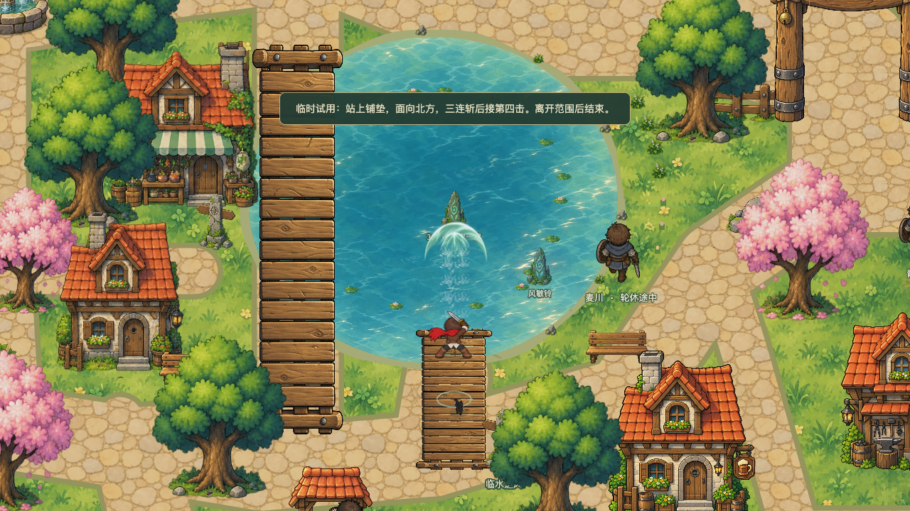
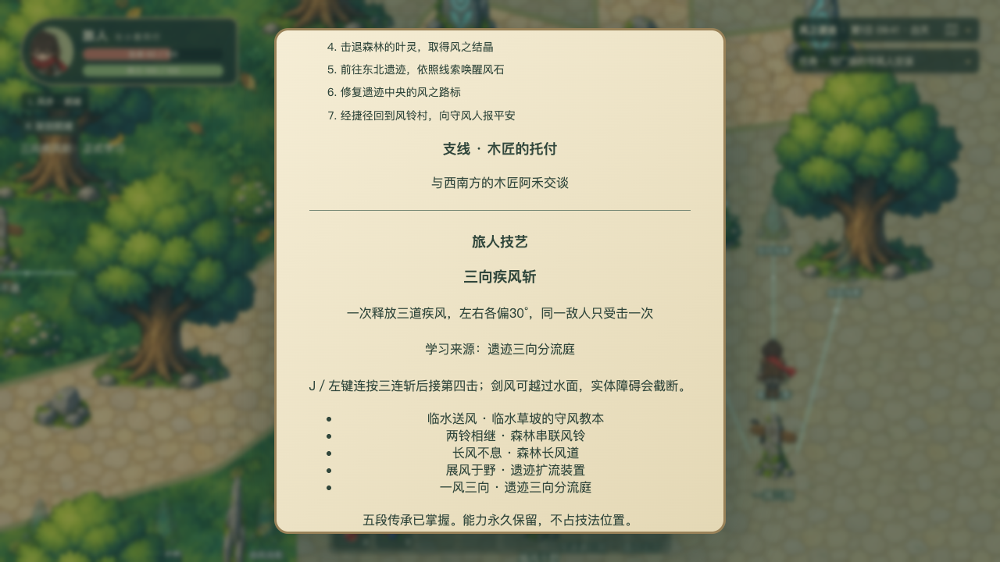
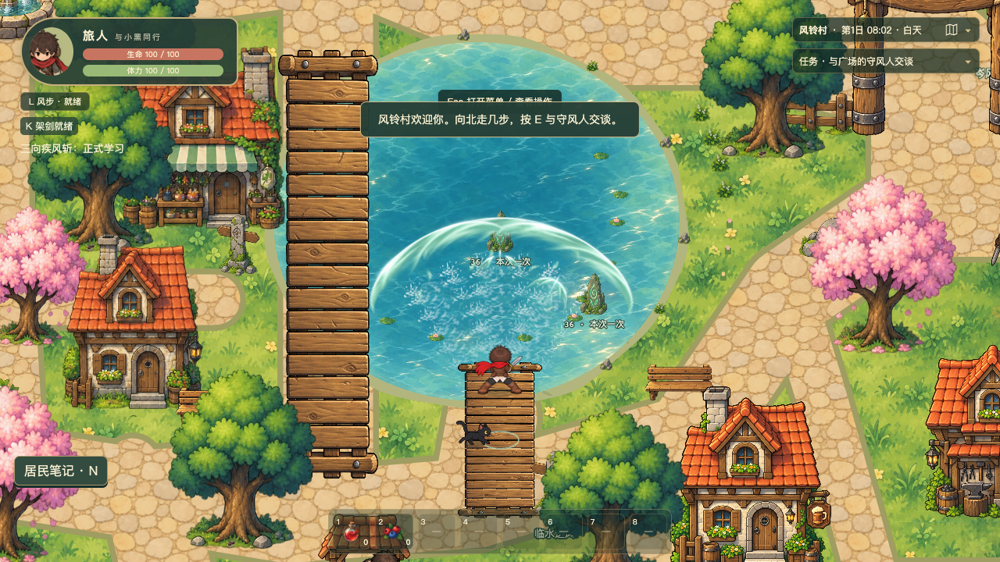

# 五阶段剑风实施与验收报告

日期：2026-09-27。实施范围为五个独特学习事件、永久进阶、旅途手记与连续划水。其他本领、技法位、身体成长和肉鸽试炼未进入本轮。已有共享工作区改动保留；没有提交、推送或公开部署。

## 实现结果

一线斩 → 双穿 → 贯通 → 疾风斩 → 三向疾风斩全部可以正式获得、使用、保存并重开。前三阶段距离300、宽28；后两阶段距离420、宽64；三向相对释放方向为−30°、0°、+30°。基础伤害36、速度900、第四击动作时序沿用原配置，装备加成在创建攻击时冻结。参数属于本轮原型默认值，尚未完成平衡验收。

五段传承使用独立事件与稳定场景编号，不连接击杀、练习次数、通用材料或主线风石奖励。固定教本和装置不受居民日程、生死或主线阶段影响；三次装置事件依靠自然风和步行操作，基础与扩流事件提供明确限定试用。后阶段事件可以提前保存，补齐前置后自动结算。

存档从版本6迁移到7，地图版本仍为6。旧正式布尔技能保留为阶段1的“旧版继承”，不捏造已完成的传承故事；技能字段采用白名单与前置一致性校验。沿用现有状态提交锁，在IndexedDB事务完成后才发布学习结果。保存中断后保留旧正式状态与有效应用，提供安全重试按钮。

一次第四击冻结统一配置与伤害，三道弹体共享释放编号和命中集合，各自处理实体遮挡。连续扫掠按接触时刻与空间顺序裁定，机关与敌人名额分开，三向重叠只有一次伤害，轨迹间的空隙不自动命中。剑风可越水，人物、风步和近战沿用原水域边界。

水迹以实际裁决路径每24单位生成浪痕、水花和涟漪，使用静态水域遮罩排除岸地、道路和桥面。宽幅与三向分别扩大、分开留痕。共用上限256的对象池，攻击水迹使用战斗模拟时间；退出与场景销毁有独立清理路径。

Q手记的“旅人技艺”显示当前效果、来源、成长记录和下一条已发现线索；HUD及操作帮助说明第四击入口。新增按钮使用正常文档流布局。

## 验证结果

| 检查 | 结果 | 证据或命令 |
| --- | --- | --- |
| 类型检查与生产构建 | 通过 | `npm run test:skill-growth`先执行TypeScript检查及Vite生产构建 |
| 完整逻辑回归 | 33文件、570项通过 | `npm test -- --maxWorkers=1`，100.79秒 |
| 学习与水迹生产浏览器验收 | 7项通过 | `npm run test:skill-growth`，单worker、无自动重试，2.4分钟 |
| 原战斗生产回归 | 1项通过 | `npx playwright test --config tools/playwright-skill-growth.config.ts --grep '生产回归'`，8.2秒 |
| 原生GPU对比 | 两个场景分别通过 | 下表；两次均为单worker，约1分钟 |
| 改动空白检查 | 通过 | 对本轮涉及的共享源码执行`git diff --check` |

八项浏览器检查是在同一冻结生产包上分两批完成。最后增加的战斗回归只增加测试观察入口，没有修改游戏源码。生产包与源码摘要记录于[校验记录](evidence/validation.json)。

### 自然生产路线

[自然旅程记录](evidence/natural-journey.json)从正式生产构建的新游戏、阶段0开始，没有导入夹具、传送、运行时改状态或开发授予。所有移动、装置选择、近战和第四击由真实键鼠输入完成；只读状态用于观察和断言。

每次正式学习后都刷新页面，再从“继续旅途”恢复阶段与事实，然后验证应用：

1. 临水教本试用，隔水风铃触发阶段1；再用正式能力触动另一枚铃。
2. 自然风串联两铃，获得阶段2；两枚前后投影各命中一次。
3. 封闭长风道泄口，获得阶段3；三枚墙前投影命中，墙后第四枚为零。
4. 一次宽幅试用触动旧射程与窄轨迹之外的两铃，获得阶段4；正式宽刃在窄通道被石柱截断。
5. 左右分流闸完成阶段5；三个方向投影分别命中，大投影只命中一次，轨迹空隙投影为零。

最后正式阶段为5，五个事实齐全，旧版继承标记为假，主线仍为0。生命62／100，黑猫未阻挡，页面异常为零。途中存在真实敌人威胁，使用原战斗处理；没有以清空敌人的夹具替代这条通关证据。





### 固定边界与生命周期

以下固定存档或测试插桩均明确标注，与自然通关分开：

- [存档边界](evidence/save-boundaries.json)：阶段0—5导入、导出、刷新恢复；旧版本6布尔技能继承；后四个事实提前完成后，再真实完成基础学习，按顺序补齐所有阶段。
- [保存失败](evidence/save-failure.json)：在真实IndexedDB写请求阶段注入一次事务中止，正式状态保持旧值；点击“重试保存已完成的经历”即可完成原证据提交，不追加新攻击。
- [水迹运行记录](evidence/water-runtime.json)：三道独立留痕、暂停时模拟与水迹相位不变、恢复后消退、返回标题清空、刷新后新池为空。
- [四处水域边界](evidence/water-scenarios.json)：森林溪面、溪桥口、池塘擦岸和池塘桥面，真实键盘三向释放；水域及桥面遮罩、斜向宽度与池上限检查通过。没有快进数值时钟。
- [死亡清理](evidence/death-boundary.json)：低生命固定档由林豕真实攻击触发死亡，回村后生命恢复100、正式贯通保留、教学与弹体清空。
- [真实场景销毁](evidence/scene-disposal.json)：仅在测试响应中接入真实Phaser场景停止入口；销毁后水迹已分配与活跃对象均为0，遮罩纹理全部移除。正式包没有该控制入口。
- [原战斗回归](evidence/combat-regression.json)：生产新游戏实际移动到木桩，普通三连累计68伤害；普通架剑自动反斩并接二、三刀累计74；风步实际位移且消耗体力。正式技能仍为0，主线没有被推进。只读预测用于确定架剑输入时机，此项不证明画面提示可读性。

逻辑测试另外覆盖移动目标扫掠、双穿排序、多帧去重、完整宽度足迹、独立侧刃遇墙、配置冻结、教学过滤、事实重复、非法状态和各旧版本迁移。已有驻防、居民、生死、任务、物品、昼夜、弹反和水域逻辑包含在完整回归中。



## 原生GPU实测

设备为Apple M5 Pro，渲染器报告ANGLE Metal；1280×720。冻结修改前构建位于本地4195，当前生产构建位于4196。各场景同一位置、时间、输入节奏，持续约22秒并完成13次第四击；记录全部帧间隔，不删除长帧。固定档关闭野怪干扰，只用于边界及压力测试。

| 场景 | 基线／当前帧样本 | 基线P95 | 当前P95 | 退化 | 当前水迹池峰值 |
| --- | ---: | ---: | ---: | ---: | ---: |
| 森林溪边，多目标三向划水 | 1321／1321 | 16.7毫秒 | 16.7毫秒 | 0% | 40／256 |
| 池塘桥面，三向跨水 | 1322／1321 | 16.7毫秒 | 16.8毫秒 | 约0.60% | 144／256 |

森林两枚投影各命中13次。停手后水迹活跃数均回到0；池保留40或144个对象供复用，连续释放期间未持续增长，场景销毁后实际归零。当前场景顶层显示对象峰值分别530、506，空闲回到499；顶层计数不包含容器内池对象，池数量独立报告。基线空闲顶层对象440。两端GPU缓冲／顶点数组／程序数量均为11／21／21。

本工作区有并行的敌人、居民和水面更新，冻结基线与当前包的差异包含这些已保留更新，不能把所有对象或纹理增加单独归因于剑风。结论限定于本机、本构建、上述两个样本，未声称长期浸泡或其他设备达到相同性能。

证据：[森林完整采样](evidence/performance-stream.json)、[池塘完整采样](evidence/performance.json)。复核命令：

```sh
npx playwright test --config tools/playwright-skill-performance.config.ts
FARWIND_SKILL_PERFORMANCE_SCENE=pond npx playwright test --config tools/playwright-skill-performance.config.ts
```

这两项要求保留本地4195基线服务和4196当前构建服务；基线使用本轮开始时冻结的`.skill-growth-local/baseline`，不能用当前源码重新构建后冒充修改前基线。

## 首因与修复说明

早期测试暴露的教本站位、原通路重叠、投影被既有树体遮挡、三向空隙目标过近，以及远铃没有充分体现旧射程边界，均已按实际场景调整并复核。导航测试沿现有寻路器做真实键盘移动，修复了岸边取整和过小目标容差，没有使用传送绕过通路。

普通敌人的命中停顿使固定墙钟按键间隔不稳定，攻击测试改为读取实际动作阶段后继续正常按键。水迹末端需要飞行时间加800毫秒才能消退，过早检查零对象的测试已改为等待实际回收。完整并行单测曾在已有驻防长模拟触发默认5秒超时；隔离单worker执行通过，未放宽断言或缩短模拟。

原战斗回归首次在三连前移后立即开始投影练习，投影位于玩家背后，因此朝北架剑未成立。退回正常教学站位后同样的键鼠回归通过；该原有近距离投影行为列入下方非阻塞发现，没有通过反复按键掩盖失败。

## 美术与体验边界

[划水设计稿](water-wake-concept.png)在接入表现前生成，属于设计参考；上述图片才是运行截图。复用现有水花、涟漪和遗迹素材后，已核对水迹不铺满扇形、不越岸或桥面、三道方向独立及手记可读。

风铃／投影目前复用遗迹符石，最终专用美术、音效听感、五次事件的游玩节奏与参数平衡仍待用户试玩验收。自动化通过不代替这些主观验收。本轮是明确的游戏原型，不宣称满足生产力功能的人工精力减少80%指标。

## 对抗式审查

VERDICT: PASS

P0/P1 BLOCKERS:

无。已检查正式与临时状态分离、版本1—6迁移到7、非法输入、乱序及重复事件、事务失败和忙锁、攻击配置冻结、装备伤害路径、移动接触与障碍优先、共享去重、弹体及视觉生命周期、世界通路、NPC独立性、用户界面与原战斗回归。候选问题经过触发路径和已有保护机制反证，没有证据充分且足以阻止本轮合并或发布的P0/P1。

| 审查面 | 因果链与已有保护 | 支持证据 |
| --- | --- | --- |
| 永久状态污染 | 开发授予／教学配置只影响运行查询；存档校验重建白名单，不保存弹体或参数 | 技能与存档模块；旧档、教学清除与导入测试 |
| 跳阶／重复奖励 | 独特事实保存后计算连续前置；重复事实不新增，机关和敌人命中分离 | 乱序、重复及阶段0—5测试 |
| 保存前发布或丢失战斗状态 | 共用提交锁立即冻结后续模拟；收齐同步帧写入后取副本；事务完成才发布，失败留旧值 | 状态提交与保存模块；真实事务中止重试 |
| 穿墙及三倍伤害 | 完整宽度扫掠、墙体优先、独立终止；一次释放共享目标集合，配置在创建时固定 | 碰撞与弹体模块；墙前／窄道／三向／移动目标测试 |
| 视觉资源泄漏 | 轨迹按模拟时间到期，事件记录有界，水迹池最多256；真实销毁移除池与遮罩 | 连续GPU数量采样及场景销毁测试 |
| 旧玩法回归 | 新传承与主线ID分开；保留原攻击、反斩、风步、近战与人物水域边界 | 570项完整回归、生产战斗回归与自然路线 |

UNVERIFIED RISKS:

- 两段约22秒的本机采样未覆盖多小时压力、不同GPU、低性能设备或所有世界遭遇；不影响本轮已测门槛的结果。
- 最终美术、设备听感、游玩节奏与战斗平衡尚未经用户验收。

NON-BLOCKING FINDINGS:

- P2：现有`parryTraining.ts`的投影始终沿木桩到玩家方向偏移34；玩家贴近木桩不足34时，投影会位于背后。朝木桩方向架剑因此无效，后退或面向投影即可恢复。生产回归首张失败截图及现有位置公式支持该结论；它不丢失进度，存在直接可见的恢复方式，未达到P0/P1。本轮未改变该原有行为。
- P2：宽刃障碍采用保守的扩张矩形足迹，斜向擦实体角落可能较严格；保证不穿墙，后续可根据手感优化精度。
- P3：风铃和投影复用符石素材；后续专用美术应保留当前真实弹道和遮罩，不能用满扇形特效替代三条轨迹。
