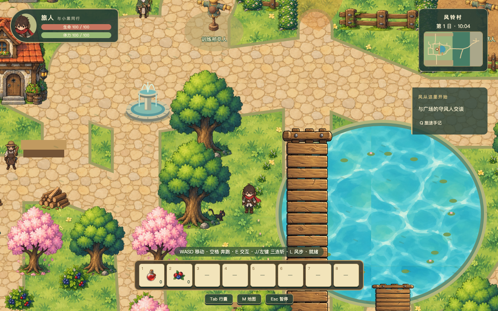
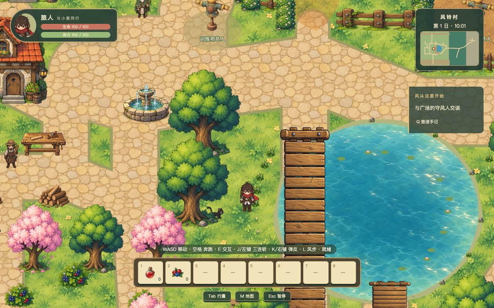
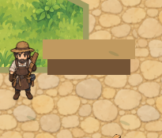
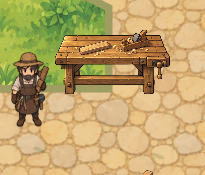
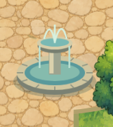
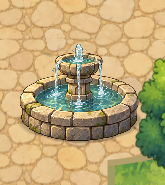
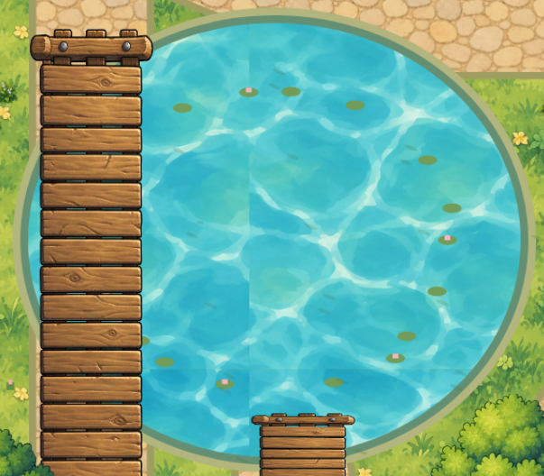
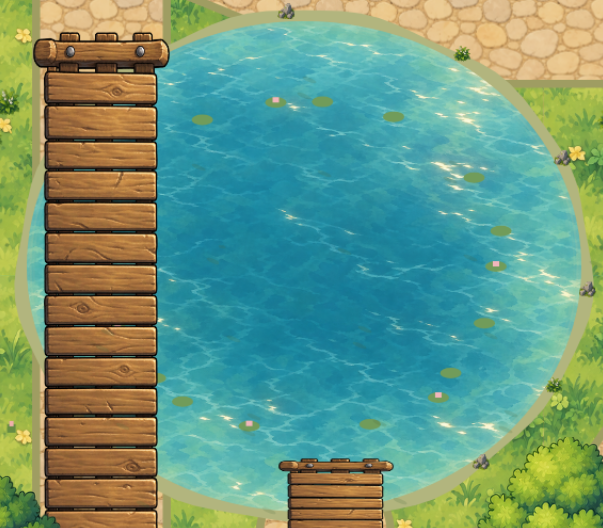

# Far Wind 村庄三处视觉修复

本任务已完成三张正式手绘资产的生成、可复现处理和实际加载接入；不提交、不推送、不公开部署。截图验收以浏览器游戏的真实画面为依据。

工作区起始和交付分支均为 `codex/initial-game`，HEAD 为 `c4c864af96813b6a1386c75ee38e95ca8bd4d65b`。原有村庄防御等未提交改动保留；执行期间其他任务继续修改战斗、输入、训练和界面，本报告单独说明其对全库验证结果的影响。

## 实际原因与替换位置

| 对象 | 实际原因 | 当前接入与旧绘制替换 |
|---|---|---|
| 木工台 | `terrain.ts` 仅以两个棕色矩形烘焙在地面，没有独立对象、桌腿或工具。不是图片加载失败，也不是可采集木材堆。 | 删除 `(360,940,105,35)` 与 `(354,930,117,25)` 的矩形。`world.ts` 新增 `carpenter-workbench` 装饰 prop，位置 `(412.5,975)`、显示117×66、脚底排序975，无交互、无新增碰撞。木匠 `(330,1010)` 和 `wood-yard-*` 保持。 |
| 广场喷泉 | `terrain.ts` 的150×150 Canvas 由纯色椭圆、矩形与曲线构成，占位材质及结构与现有手绘资产不一致。 | 删除整段 `createCanvas("fountain",...)`。`World.preload()` 正式加载 `plaza-fountain.png` 到 `fountain`，原 `plaza-fountain` 的 `(680,890)`、130×130和100×45实体全部保留。源图裁切并底部对齐后，以底座脚底锚点显示。 |
| 池塘 | `water.png` 是图集左下627×627象限，四边颜色和波纹结构不连续。真实竖缝在x=1254，对应627纹理周期；地表边界x=1200位于左侧54像素。 | 池塘改用独立 `pond-water`，在原水体阶段以完整520×460世界矩形统一 `drawImage`，裁切至原POND椭圆；各区块共享同一世界坐标，不重复或重新起算相位。原河道 `water` 不替换。 |

定位文件：`src/game/systems/terrain.ts`、`src/data/world.ts`、`src/game/scenes/World.ts`。完整修改前调查见 [DIAGNOSIS.md](DIAGNOSIS.md)。

## 正式资产与处理

每张图片都由内置 imagegen 独立生成，实际输入 `../design.png`（仓库上一级根目录参考）、`public/assets/house.png` 与 `public/assets/level-rework/bridge-candidate.png`；没有用几何图形重画另一版主体，没有使用自行配置的外部付费API。提示词记录在 `docs/ASSET-PROMPTS.md`。

| 用途与纹理key | 源图，均位于 public/assets/village-polish/ | 运行PNG | 实际源尺寸 → 运行尺寸 | 游戏显示/锚点 | 碰撞 |
|---|---|---|---|---|---|
| 木工台 `carpenter-workbench` | carpenter-workbench-source.png | carpenter-workbench.png | 1611×976 → 351×198 | 117×66；(0.5,1) | 沿用无阻挡装饰语义 |
| 喷泉 `fountain` | plaza-fountain-source.png | plaza-fountain.png | 1254×1254 → 390×390 | 130×130；(0.5,1)，底部对齐 | 原100×45落地占地 |
| 池水 `pond-water` | pond-water-source.png | pond-water.png | 1330×1182 → 1040×920 | 520×460世界矩形；(0,0)，从(1020,890)绘制 | 沿用POND逻辑，未改变 |

两个物体的背景有真实alpha，未烘焙棋盘格或白底。处理以alpha大于2定位实际内容，边界外留8源像素，保留半透明水花与阴影。池水源图意外全图半透明，运行图移除alpha但保留RGB，保证道路不会透出。有效裁切、运行有效内容边界与alpha范围均记录在 [asset-processing.json](asset-processing.json) 和 `public/assets/manifest.json`。

可复现命令：

```sh
node tools/prepare-village-polish.mjs
node tools/asset-report.mjs
node tools/diagnose-pond-water.mjs
```

`tools/asset-report.mjs` 保留专项子目录记录和既有额外登记字段；`tools/prepare-assets.mjs` 改为调用统一登记器，不再覆盖成另一种清单结构。实际运行登记器已验证三条记录仍存在。重新处理图片会将状态回到待验收，应重新运行截图和测试。

运行链路：源图 → `prepare-village-polish.mjs` → `public/assets/village-polish/*.png` → `World.preload()` → 正式纹理key → `world.ts` prop / `terrain.ts drawImage` → 下方真实游戏截图。源图从未被当作运行图加载。

## 层次与生命周期

地面、土路 → 轻微起伏的岸底 → 整片池水 → 克制的浅水过渡 → 零星原有草石与荷叶 → 原桥梁。以上仍烘焙在原28个600×550地表区块；角色、黑猫和工作台/喷泉按脚底独立排序，水效只位于喷泉池内。没有额外高层水图覆盖桥。

岸底只在原椭圆之外约6～14像素变化，去掉原8像素粗绿色描边，以低透明度浅水和少量原有草石打散机械边缘，桥附近不新增装饰。`POND`、`BRIDGES`、两处桥通道及全部水域碰撞函数保持。

喷泉石质主体静止，仅两处落水点添加很轻的扩散涟漪；暂停后水效冻结。池塘水图静态，不每帧重绘世界或创建纹理。地表纹理在场景shutdown时释放，resize监听同步解绑；图片纹理由游戏纹理管理器复用。实际场景重启前后地表28、纹理77、水效2、resize监听4一致，对象总数329→324，没有资源累计。无关按需战斗Graphics的总数变化未被伪装为本专项泄漏。

## 真实运行前后对比

相同站位 `(940,1120)`，相同初始游戏时间600，1280×800视口；暂停冻结镜头并只隐藏暂停对话框，正常HUD保留。下图没有经过绘图修饰。

修改前：



修改后：



1365×853视口的相机缩放为1.06640625：[修改前](before/overview-1365x853.png)、[修改后](after/overview-1365x853.png)。修改后最终全景另由构建产物的本地生产预览4181端口采集；开发服务首版及岸线迭代分别保存在 `candidate-first/`、`after-dev/`。其他任务带来的控制提示差异不属于本任务的界面修改。

局部图仅裁切隐藏HUD后的真实截图，池塘裁切覆盖可见池面，不是生成预览图：

| 对象 | 修改前 | 修改后 |
|---|---|---|
| 木工台 |  |  |
| 喷泉 |  |  |
| 池塘 |  |  |

诊断图与运行截图分开：[旧水纹3×3平铺诊断](old-water-tiled-3x3.png)、[纯色替换的真实运行诊断](solid-diagnostic/pond-1365x853.png)。纯色只通过测试浏览器拦截资源请求，未改动原水图。

旧纹理左右/上下边平均通道差12.225/14.788，内部相邻列/行约1.502/1.594。新地表真实采样在x=1200、x=1254、y=1100、y=1254的相邻像素差中位数分别1、1、1.667、2；不同缩放及移动截图未见原重复缝或新区块线。新池图不采用平铺方案，因此不存在需要新3×3平铺图去证明的重复边界。

## 行为、开销与测试

`tests/visual-polish.spec.ts` 从新游戏开始，全部推进通过真实键盘输入；仅测试浏览器读取Phaser实例以核对图片像素、资源数量和执行正式场景重启，没有修改游戏状态冒充通关。

已验证工作台、喷泉前后遮挡与落地点，木匠E交互，喷泉原碰撞，两处桥梁，桥北端池水阻挡，南/东/北池岸移动，黑猫全程跟随且不穿实体或水域。完整轨迹对每个位置和每两次采样间连续路径核对碰撞；木工台附近有70个黑猫后方与79个前方样本，喷泉21个后方与61个前方样本。见 [行为报告](behavior/movement-report.json)、[跟随统计](behavior/companion-crossings.json) 和 [纹理/生命周期报告](behavior/render-report.json)。

图例：[喷泉后方](behavior/fountain-behind.png)、[喷泉前方](behavior/fountain-front.png)、[工作台后方](behavior/workbench-behind.png)、[工作台前方](behavior/workbench-front.png)、[木匠对话](behavior/carpenter-interaction.png)、[西桥北端](behavior/bridge-west-north.png)、[西桥南端](behavior/bridge-west-south.png)、[南桥上端](behavior/bridge-south-top.png)、[非整数缩放北岸](behavior/north-shore-fractional.png)、[非整数缩放东岸](behavior/east-shore-fractional.png)。

运行帧率短样本中位数在1280视口为60.024→60.000，1365视口为60.048→60.000；没有明显退化。新增运行PNG保守RGBA解码约4.50MiB，替代旧喷泉Canvas约0.086MiB。世界地表区块数不变，每帧只多两个很小的水效对象。[performance.json](performance.json) 记录条件与数字。SwiftShader软件渲染和100帧样本不能代替目标设备GPU与长时间性能验收。

执行结果与首因历史见 [VALIDATION-HISTORY.md](VALIDATION-HISTORY.md)。首次完整接入时 `npm run typecheck`、`npm test`（76项）和 `npm run build` 全部通过。当前最终全库验证、专项与既有Playwright回归的具体结果记录在报告末尾，不能以早期通过覆盖后续失败。

## 对抗式审查

VERDICT: PASS（本次三处视觉修复及其接入代码）

P0/P1 BLOCKERS：无。反证检查覆盖图片真正加载而非旧key残留、脚底与透明留白分离、无新增整图碰撞、桥后覆盖关系、世界纹理采样相位、暂停与shutdown、原水纹消费者、现有NPC交互和非整数缩放。未发现本次改动存在达到P0/P1的可达缺陷。

UNVERIFIED RISKS：目标设备GPU及长时性能未测；并行编辑期间出现过敌人/战斗测试差异，最终84项单元测试已通过；本次没有完成其他任务新增战斗特效的全面视觉审查，也不以本专项PASS代替整库发布审查。

NON-BLOCKING FINDINGS：池塘保留原少量程序化荷叶；其风格细节不影响此次水面连续性。构建仍有主JS包超过500kB的既有提示，不为三个装饰物引入额外拆包工程。


## 最终结果

| 检查 | 结果与证据 |
|---|---|
| 类型检查 | `npm run typecheck` 通过；并行任务未完成时的错误已随其源码完成消除 |
| 单元测试 | 当前 `npm test` 84/84通过，8个测试文件；之前79通过/5失败的中间结果未隐瞒，详见验证过程记录 |
| 构建 | `npm run build` 通过；仅主JS包体积既有提示 |
| 本专项Playwright | 初次稳定视觉版本2/2；最新源码再验2/2，零跳过、零重试、零flaky，见 `playwright-results.json` 与 `latest-playwright-results.json` |
| 既有相关Playwright | 动画2项、会话2项、局部地图2项，共6/6，零跳过、零重试、零flaky，见 `regression-results.json`。在关闭热更新的稳定视觉版本执行；随后最新源码另复核本专项2项 |
| 生产预览 | 本地4181端口，两个视口同机位截图；页面错误、资源404与重复key错误均为零 |
| 正式资产处理与清单 | 两主体真实alpha、池水完全不透明；根目录登记器保留3条专项记录；脚本及有效边界记录完整 |
| 碰撞与跟随 | 工作台无新增阻挡；喷泉原占地；双桥和原水域逻辑边界保留；完整玩家/黑猫轨迹与连续线段通过 |
| 连续性 | 完整池图无内部重复周期，原1254缝消除，1200/1100分块采样连续；相机移动、窗口变化和不同水效时刻已检查 |
| 暂停与资源清理 | 喷泉涟漪在暂停中冻结；正式场景restart后纹理、地表、水效和resize监听计数稳定，无累计 |
| 运行开销 | 同机位短样本中位约60FPS；运行纹理净增约4.41MiB；没有每帧重绘世界或创建纹理 |
| 未验证 | 目标设备GPU、长时间运行性能；其他任务的新战斗特效全面视觉验收；未做提交、推送或公开部署 |

已执行本次图片和实际运行画面复核：工作台无需标签即可辨认，喷泉材质、厚度和自然水流与周围手绘资产协调，池塘在两种视口与真实移动中没有明显拼接线。运行资产登记状态已更新为本轮运行验收通过，源图/诊断图不冒充运行证据。`source-snapshot.json` 记录交付时源码与正式PNG的SHA-256，后续其他任务改动需要自行重新验收。
