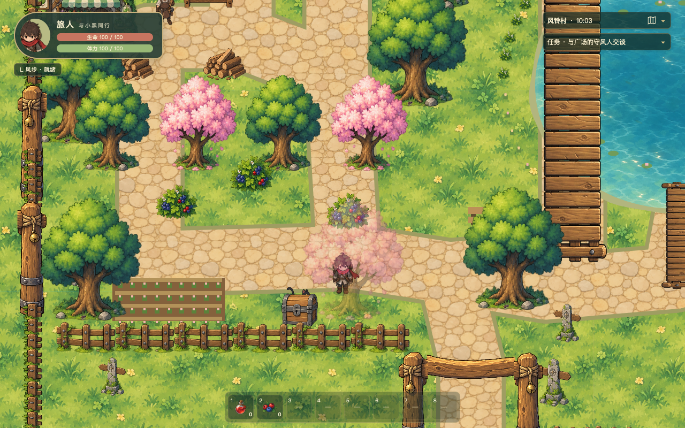
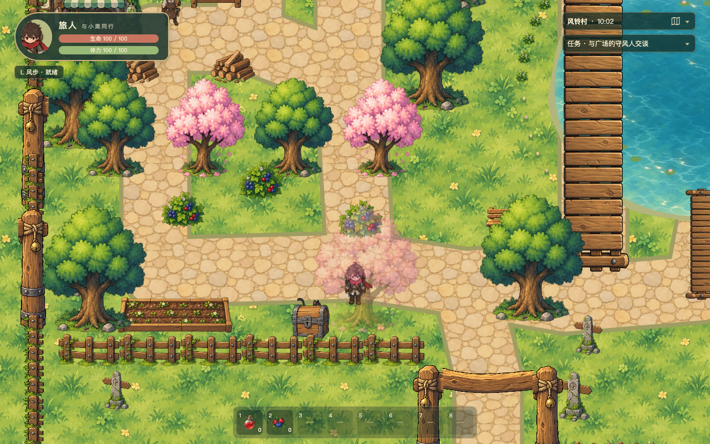
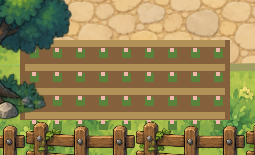
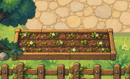
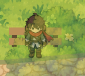
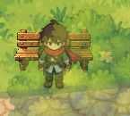
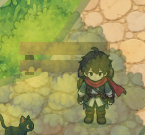
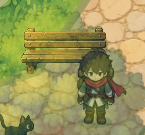

# 果园花床与池边长椅视觉修复

两处箭头所指的程序化装饰已换成正式手绘透明图片。花床保留原位置与地面语义；长椅的两个既有实例均替换，按脚底排序。没有扩大地图、移动树木、增加碰撞或交互。

## 实际原因与替换位置

花床原来在 `src/game/systems/terrain.ts` 的果园装饰段由棕色底板、直线横条和绿色/粉色方块生成，只有平面格子，缺少土壤、木边和植物形状。现在第36行取得 `orchard-flower-bed` 图片，第138行以世界矩形 `(230,1480,210,80)` 绘制。原花床矩形循环全部删除。

右箭头是西桥南端树后的木长椅。原来同文件用两根矩形立柱与两块矩形座板绘制两个实例，缺少靠背、座面和支架层次。原长椅绘制循环全部删除；`src/data/world.ts:381`、`:382` 登记 `pond-bench-west` 和 `pond-bench-east`，落地点分别为 `(940,1380)`、`(1540,1350)`，同用 `village-bench` 图片，宽90、高50。原宽度90及原脚底落点保留；增加可辨认的靠背高度，未放大平面占地。它们是无 `kind`、无 `solid` 的非交互装饰。

长椅被现有树冠遮挡属于布局：西侧树根 `(980,1540)`、东侧树根 `(1530,1510)`。未为展示资产移动树木或抬高椅子层级；玩家靠近时沿用原树冠淡出，前后排序以真实脚底为准。

## 正式资产与运行链路

| 资产 | 源图实际尺寸 | 运行尺寸 | 游戏尺寸与锚点 | 绘制及占地 |
| --- | --- | --- | --- | --- |
| `public/assets/village-polish/orchard-flower-bed-source.png` → `orchard-flower-bed.png` | 1983×793 | 630×240 | 210×80；左上 `(0,0)` | `(230,1480)` 地表；无碰撞 |
| `public/assets/village-polish/village-bench-source.png` → `village-bench.png` | 1706×922 | 270×150 | 90×50；底部中心 `(0.5,1)` | 两个既有落地点；无碰撞 |

使用内置 imagegen 分别生成，实际输入根目录 `design.png`、房屋、药床或手绘桥梁与上一轮木工台。完整提示词及参考文件在 [prompts.json](prompts.json)，公共制作记录补入 `docs/ASSET-PROMPTS.md`。未调用自行配置的外部付费 API。

处理脚本为 `tools/prepare-orchard-polish.mjs`，使用已有 Sharp；按实际有效alpha边界裁切，保留8源像素边缘、半透明阴影及空隙，保持比例缩放、底部对齐。两个运行 PNG 都有真实alpha，范围0–255；源图尺寸、有效裁切和运行有效边界见 [asset-processing.json](asset-processing.json) 及 `public/assets/manifest.json`。没有把棋盘格或白底作为背景烘焙进去。源图主体大部分alpha为252–253，按原值保留，不用二值化抠图改变笔触。

运行链路：源图 → 处理脚本 → 两张运行 PNG → `World.ts:130–132` 的 `preload` → `orchard-flower-bed` / `village-bench` → 地表 `drawImage` / 现有 prop 图片循环 → 下列真实浏览器截图。测试逐像素核对实际加载纹理与文件相同，并核对花床地面11,412个有效样本全部匹配。

分层为地面与低花床 → 岸边/水面 → 桥（既有地表烘焙顺序）；长椅、树、人物和黑猫独立按落地点排序。未新增高层水面或每帧重绘地表。

## 真实游戏前后截图

截图脚本为 `tools/capture-orchard-polish.mjs`。存档导入只用于建立固定截图机位；行为验证另从新游戏用真实键盘完成。主机位为 `(660,1510)`，两侧长椅机位为 `(940,1400)`、`(1570,1400)`。每个机位均保存1280×800和1365×853视口，后者缩放为1.06640625。`before/` 为修改前，`candidate-first/` 为首版放入开发场景比较，`after/` 为构建版在本地4182端口的截图。

正常 HUD 全景，修改前：

正常 HUD 全景，修改后：

下表局部图仅裁切临时隐藏 HUD 的真实运行截图，没有补画或修饰。

| 检查处 | 修改前 | 修改后 |
| --- | --- | --- |
| 果园花床 |  |  |
| 西侧长椅、原树冠淡出机位 |  |  |
| 东侧相同长椅 |  |  |

非整数缩放的[正常 HUD 全景](after/overview-1365x853.png)、[花床局部](after/flower-bed-1365x853.png)、[西椅局部](after/west-bench/bench-1365x853.png)、[东椅局部](after/east-bench/bench-1365x853.png) 已复核，无新增采样缝或拉伸闪烁。新花床能辨认木框、三条土畦、幼苗及粉白小花；长椅能辨认靠背、座面和脚架。未用更大体积或鲜艳颜色制造精细效果。

`-source.png` 和运行资产 PNG 是生成及处理图片，均不是游戏截图。本次没有新的平铺材质；上一轮水纹诊断及3×3平铺图保留在父目录。

## 行为、资源及开销

新专项真实键盘检查覆盖花床四侧及可通行区域、两张椅子前后、两处桥梁、相机跟随和窗口变化。连续轨迹同时核对玩家和黑猫的脚底与线段碰撞，黑猫经过椅子前后且未卡住。[移动报告](behavior/movement-report.json) 与 [轨迹](behavior/movement-trace.json) 保留实际坐标。原有[浆果采集](behavior/berry-interaction.png)及[宝箱领取](behavior/chest-interaction.png)正常。

场景重启前后均为28块地表、79个纹理、2个长椅和4个缩放监听，没有新增重复对象、重复纹理 key、404或控制台错误。详见 [渲染及生命周期报告](behavior/render-report.json)。本次只增加两个静态 prop 和两张纹理，源图不进入运行加载，运行RGBA增量766,800字节（约0.73 MiB），没有新动画、每帧纹理创建或世界重绘。

截图过程的帧率中位数：1280×800前后均约60.05；1365×853由60.07到60.02。未观察到明显退化。采样含启动/导入/截图，采用软件WebGL且存在其他并行任务，因此不能据此宣称设备GPU性能通过；完整分位数和限制在 [performance.json](performance.json)。

## 测试结果与审查

- `npm run typecheck`：通过。
- `npm test`：10个文件、153项通过。
- `npm run build`：通过；仍有原 Phaser 主包超过500 kB的提示，本次没有加入依赖或增大游戏脚本逻辑。
- `FARWIND_EVIDENCE_DIR=docs/visual-polish/orchard/regression npx playwright test tests/orchard-polish.spec.ts tests/visual-polish.spec.ts --config tools/playwright-orchard-polish.config.ts`：4项全部通过，耗时2.3分钟，结果在 [playwright-results.json](playwright-results.json)。
- 新增 `tests/orchard-polish.spec.ts`：真实行走、交互、两张正式图片像素核对、花床实际地面核对及场景重启通过。
- 上一轮 `tests/visual-polish.spec.ts`：木工台、木匠交互、喷泉、池岸、桥、水面边界、共享水纹及暂停/重启回归通过，证据在 `regression/`。

首次检查发现测试站位进入既有围栏安全余量、假设源alpha为全不透明，以及测试画布与 Phaser 画布的缩小滤波路径不同。完整首因、原始失败和修正依据见 [VALIDATION-HISTORY.md](VALIDATION-HISTORY.md)。没有删去或放宽真实碰撞、交互和像素匹配门槛来掩盖游戏回归。

VERDICT: PASS

P0/P1 BLOCKERS：无。已检查实际加载链、世界坐标、底部锚点、透明边界、排序、碰撞/交互、桥层级和重启生命周期；未发现支持范围内可达的严重正确性或可靠性问题。

UNVERIFIED RISKS：真实设备GPU长时间性能、其他浏览器尚未专门测量，不影响本次静态装饰修复结论。

NON-BLOCKING FINDINGS：两张长椅在固定全景中仍部分被原树冠遮挡；这是既有位置关系，已有自然淡出及真实经过截图。源图/图片质量以实际运行效果核对，未以构建成功代替美术验收。

## 工作区状态

起始分支 `codex/initial-game`、HEAD `c4c864af96813b6a1386c75ee38e95ca8bd4d65b`。验收期间检测到外部操作使HEAD变为 `7b14751efeb576efaf7bc7c882248e612c16a973`，没有为恢复基线而重置或覆盖。初始及最终摘要见 [baseline-state.json](baseline-state.json)、[final-state.json](final-state.json)。本任务未执行提交、推送或公开部署。
