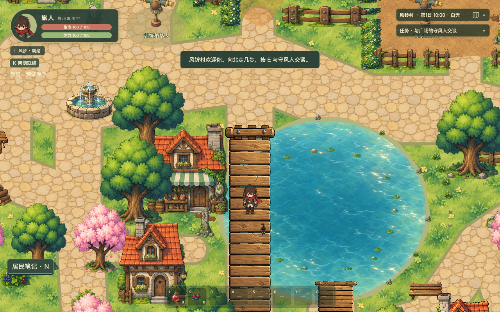

# 风铃村动态水景验收

本页保存首轮验收。之后已针对用户使用的5173增强默认视口可读性，并直接复核该服务；当前效果、真实录屏和本轮结果见[5173复核报告](instance-5173/REPORT.md)，请勿把首轮5221截图当作当前5173的最终画面。

喷泉已接入持续落水、少量飞溅和向外扩散后消失的涟漪；池塘保留原手绘底图，增加局部缓慢波纹、错相反光与荷叶微浮动。最终专项浏览器检查通过，正常 HUD 截图与真实录屏见下文。全量浏览器回归存在失败，不能据此宣称整个游戏回归通过。

## 工作区与实际原因

本次起点为 `codex/initial-game`，HEAD 为 `eac16f44dcc6c9b745dc5d6d24065ca841ba346c`。实际工作区已有大量未提交的日夜、居民、战斗反馈等改动，以这些现有代码为准继续工作，没有回退、提交、推送或公开部署。测试使用隔离副本，保护已有截图与其他任务产生的证据。

修改前的 `World.ts` 在创建 prop 后，用两个固定世界坐标的椭圆和循环往返 Tween 表示喷泉涟漪；原喷泉 PNG 中的水流完全静止。仅调整椭圆透明度和大小，无法表现从喷口到落水点的连续运动，而且依赖全局 Tween 的暂停状态。原逻辑位于起点副本的 `World.ts:281`。

修改前 `terrain.ts:157–206` 把基础池水、浅水环、岸边小物、18 个几何荷叶/小粉块荷花和两座桥一起烘焙到地面缓存。因此水面不能变化；若直接在地面之上盖动态水图，又会盖住桥、荷叶与浅水过渡。

现有 `POND` 仍为 `(1280,1120)`、半径 `(260,230)`；`BRIDGES` 仍为西桥 `(1030,900,120,550)` 和南桥 `(1260,1300,100,200)`。喷泉仍为 `plaza-fountain`，位置 `(680,890)`、显示 `130×130`、占地 `100×45`。`world.ts`、`obstacles.ts`、`main.ts` 未因本次水景改动而修改；共享河流水纹也未更换。

## 实际实现与显示层

- `src/game/systems/waterEffects.ts`：负责资源预加载、对象创建、两处水景更新、离屏跳过与资源释放。`World.ts` 仅接入创建、有效游玩状态、暂停和新游戏重置。
- `src/game/systems/waterMotion.ts`：集中速度、数量、透明度、层级、喷泉原图锚点、荷叶幅度及环境时钟。喷泉效果从实际 prop 的原点和显示尺寸换算，未使用截图像素或另写世界坐标。
- `terrain.ts:140–156`：继续缓存静态岸底与统一世界坐标采样的基础池水；旧的浅水过渡、岸边小物、荷叶、荷花及桥面绘制已移除。

池塘层序为：地面与基础池水缓存 `-20` → 动态局部水纹 `-19` → 浅水过渡与岸缘装饰 `-17` → 荷叶/荷花 `-16` → 桥面 `-15` → 按落地点排序的原角色与 prop。

基础水面没有整体平移，也不逐帧重画地图。动态层使用原手绘池水提取的 3 种透明笔触贴片：12 片低幅波纹、7 处错相反光、3 处稀疏小涟漪。贴片位置根据 `POND` 推导，最大动画矩形的四角全部位于内缩 10 像素的椭圆内；椭圆为凸集，因此所有贴片像素均在池内。这样避免整池离屏滤镜，又保证岸线和道路不受水效覆盖。

18 个荷叶锚点沿用原来的确定性分布，各自仅上下浮动最多 1.25 世界像素，周期 5.8 秒。原桥占地范围内的荷叶不显示；荷花随所属荷叶一起运动。没有旧缓存副本。两座桥继续复用原素材 `(0,92,1983,601)` 裁切，原尺寸、位置、90 度旋转及逻辑通道保持一致。

喷泉原石质 prop 完全不参与动画。其上只有两个局部层：原水流区域的透明纹理流动，以及挖除中央柱、按原图真实水色与 alpha 裁切的内池涟漪/飞溅。遮罩排除前池沿，使原主体直接遮挡水效；不再叠画另一份半透明石面或阴影。涟漪单向扩散，透明时重生，不缩回。飞溅和 9 个小水滴复用固定对象，没有每帧创建粒子。原两个椭圆 Tween 已删除。

核对了本地 Phaser **4.2.1** 的源码和类型后，使用原生内部纹理 Mask。Container 没有自身尺寸，需显式 `setFiltersFocusContext(false)` 并指定局部范围，否则会错误选择整相机范围；该问题在首个候选中被发现并修正。未套用 Phaser 3 GeometryMask，未增加 DOM Canvas、视频层、渲染器或依赖。

## 时间与生命周期

环境时钟由有效游玩的 `delta` 推进，独立于战斗 sim、命中停顿及全局 Tween。菜单、标题、保存冻结、非游玩状态及页面隐藏时停止。恢复首帧丢弃挂起 delta，正常步长上限 50 毫秒，不补发粒子。失焦/隐藏入口也直接暂停水效，覆盖 UI 忙碌时的情况。

离开视野时隐藏动态层并跳过其动画对象更新；重新出现时直接按当前环境相位计算，不积累发射任务。浅水过渡只在创建时生成一次 `554×494` 的缓存图。

菜单返回标题和继续复用既有模块；重新开始只重置环境相位。场景 shutdown/destroy 幂等销毁模块拥有的对象、岸缘缓存纹理与新增桥裁切帧，移除自身监听器，保留共享的喷泉、池水、桥面和水效预加载纹理。原 `propImages` 中的喷泉对象与现有 `refresh()` 语义保留。环境相位没有写入存档。

## 正式素材和处理链路

运行素材位于 `public/assets/water-effects/`，处理脚本为 `tools/prepare-water-effects.mjs`，清单登记在 `public/assets/manifest.json`。源图、实际尺寸、裁切、显示尺寸/锚点、无碰撞语义、SHA-256 和验证状态见 `asset-processing.json`。重新处理会按资源 ID 合并清单，只有摘要改变才取消既有验证状态，不覆盖其他资源记录。

| 素材 | 实际尺寸 | 用途 |
|---|---:|---|
| `water-flow-mask.png`、`water-basin-mask.png` | 各 390×390 | 与正式原图对应的流水和内池遮罩 |
| `water-flow.png` | 32×128 | 原流水笔触提取的连续落水纹 |
| `water-ripple.png` | 104×50 | 原泡沫弧线分离出的涟漪 |
| `water-splash.png` | 56×58 | 原落水飞溅笔触 |
| `water-drop.png` | 20×30 | 顶部水滴高光与半透明边缘 |
| `water-waves.png` | 768×160 | 三帧 256×160 的不同局部水纹贴片 |
| `water-lily.png` | 80×48，显示 20×12 | 正式透明荷叶 |
| `water-flower.png` | 32×24，显示 8×6 | 正式透明荷花 |

流水、水花与池水贴片从现有正式手绘资产分离，石质主体没有重画。荷叶/荷花使用内置 imagegen，以现有喷泉、池水图片作为图像参考生成；保留 `water-lily-source.png`（1774×887）和 `water-flower-source.png`（1448×1086）。首版荷叶带光晕，已弃用；最终是边界清晰的真实 alpha 剪影。提示与弃用原因见 `asset-prompts.json`。

流水纹首尾逐通道相同，垂直重复边界最大 RGBA 差为 0；3×3 检查见下图。仅延拓首尾 8 行，未模糊整片图片。横向不作为无缝水面使用。池塘采用独立局部贴片，没有平铺这三帧，也没有平移整张底图。水滴、飞溅和生成素材保留真实透明度，没有棋盘格或白底。

真实加载链路为：源图/原正式图 → 可复现透明分离与裁切 → 运行 PNG → `WaterEffects.preload()` 对应的 `water-*` 纹理 → 原生相机下的水景对象 → 以下实际运行截图和视频。9 项运行纹理合计 RGBA 展开约 **1.70 MiB**，源图不加载到游戏。另有约 1.04 MiB 的一次性岸缘缓存，以及两个喷泉局部滤镜，未生成整池或整地图的逐帧纹理。

## 真实截图与录屏

以下均为实际游戏画面。全景保留正常 HUD；局部检查只隐藏 HUD/既有昼夜覆盖并按世界坐标裁切，没有补画、修饰或插帧。前后同站位 `(1090,1130)`、相同视口。

| 视口 | 修改前 | 最终修改后 |
|---|---|---|
| 1280×800，DPR 1 | [正常 HUD 全景](before/overview-1280x800-dpr1.png) | [正常 HUD 全景](after/overview-1280x800-dpr1.png) |
| 1365×853，DPR 1.5 | [正常 HUD 全景](before/overview-1365x853-dpr1.5.png) | [正常 HUD 全景](after/overview-1365x853-dpr1.5.png) |
| 喷泉局部 | [旧画面](before/fountain-a-1280x800-dpr1.png) | [时刻 A](after/fountain-a-1280x800-dpr1.png)、[2.3 秒后](after/fountain-b-1280x800-dpr1.png) |
| 池塘局部 | [旧画面](before/pond-a-1280x800-dpr1.png) | [时刻 A](after/pond-a-1280x800-dpr1.png)、[2.3 秒后](after/pond-b-1280x800-dpr1.png) |

[喷泉短录屏](video/fountain.mp4)：默认机位及游戏相机 2 倍近景，约 18.1 秒。

[池塘、两座桥及挥剑短录屏](video/pond-bridges.mp4)：真实键盘行走、保留正常 HUD，约 13.1 秒。视频只裁去建档菜单和加载等待，没有修改游戏像素。实际过程、相位与错误记录见 `video/record.json`。

首版局部滤镜错位及随后整池滤镜开销较高的候选保留在 `candidate-1/`、`candidate-2/`。`candidate-3/` 为最终水滴透明边缘处理前的成功候选；均不是最终验收图。源图、诊断图、候选图与真实最终运行图已分开保存。

## 专项检查

最终 4 项 `tests/water-effects.spec.ts` 全部通过。`tools/playwright-water-effects.config.ts` 使用最终源码副本 5221；源码与运行素材摘要和工作区一致，见 `final-source.json`、`final-runtime-source.json`。

- 固定相机相隔 2.3 秒，喷泉流水局部与池塘中心局部发生变化；前池沿、空桥面及池外草地控制区域变化为 0。没有用角色/HUD/昼夜造成的整图差异冒充动画。实际数值见 `behavior/local-motion.json`。
- 收窄为原图真实水域遮罩后，同机位的修改前/后石面与接地阴影采样逐通道差异均为 0；不是只检查它们在动画期间不动。见 `behavior/stone-before-after.json`。
- 玩家与黑猫用真实按键经过喷泉前后、西桥、南桥和东岸；黑猫未报告阻挡。窗口变化后相机缩放为 `1365/1280`，荷叶始终围绕固定锚点、最多 1.25 像素，不重复、不越岸、不穿桥。过程见 `behavior/movement.json` 和同目录截图。
- 暂停后环境时间不变；恢复不快进。3 次通过正式菜单返回标题再继续，对象数量与纹理数量稳定；真实 Scene stop/start 后，模块旧实例已销毁，自有缓存清除，共享纹理仍存在。见 `behavior/lifecycle.json`。
- 真实训练目标命中产生战斗停顿时，环境时间与流水纹理偏移继续变化。诊断相机只改变观察位置，没有改战斗运行状态。离屏半秒时环境时间推进、可见性为 false、两处绘制计数保持不变；返回视野后正常更新，见 `behavior/hitstop-culling.json`。
- 原生同窗标签页切换使 `document.hidden=true`，隐藏 1.2 秒环境时间保持完全不变，返回后仍处于暂停，继续后正常推进。使用无模拟焦点的官方 Chrome 默认上下文验证，未伪造隐藏属性或事件，见 `video/visibility.json`。普通 Playwright 新上下文会强制模拟焦点，其首次诊断不作为隐藏通过依据。
- 两种像素密度、相机移动、静态遮挡、404、重复纹理 key 与页面错误检查均通过。森林共享 `water` 素材与河道绘制未被本次改动。
- 最终生产构建在本地直接运行，未注入开发用游戏实例或替换编译源码，按正式菜单导入相同机位。喷泉/池塘局部变化通过，池沿和桥面保持不变，错误为空；见 `production/result.json`、[生产构建正常HUD全景](production/overview.png)。复现脚本为 `tools/verify-water-production.mjs`，仅在本机预览，没有公开部署。

## 命令执行与性能

`npm run typecheck` 和 `npm run build` 均通过。构建有原有大型 JavaScript chunk 提示，没有为水景更换渲染器或依赖。最终 `npm run test` 的 **22 个文件、432 项全部通过**，其中新增 5 项水效逻辑检查已登记到显式列出文件的执行命令，见 `unit-results.json`。

实际执行汇总见 `execution-results.json`。新增逻辑测试为 `tests/water-motion.test.ts`，行为测试为 `tests/water-effects.spec.ts`，正式菜单/键盘验证辅助为 `tests/water-navigation.ts`。截图、录屏、性能和隐藏状态复现分别使用 `tools/capture-water-effects.mjs`、`tools/record-water-effects.mjs`、`tools/measure-water-effects.mjs` / `tools/measure-water-cost.mjs`、`tools/check-water-visibility.mjs` / `tools/verify-water-hidden.mjs`。这些验证工具不进入游戏运行包。

`npm run test:e2e -- --workers=1` 的默认全量 **145 项已执行结束：97 项通过、46 项失败、2 项跳过，退出码 1**，耗时约 105.7 分钟。没有修改原断言。完整逐项状态与首个错误见 `full-run-summary.json`，原始结果见 `full-browser-results.json`。最终水景专项独立执行 **4/4 通过**。全量冻结副本为较早实现，最后的水滴透明边缘、内池遮罩/删除重复石面层、参数集中和失焦暂停入口由最终副本专项、截图、录屏和直接生产构建检查覆盖；全量结果不能冒充最终版本的完整回归。

46 项失败中，已核实的执行限制包括专用夹具/证据输出目录缺失、默认配置未录屏但用例要求 `page.video()`、生产专用断言实际指向开发服务、4188 专用服务未启动，以及一次 Node 测试进程约 4 GiB 堆上限耗尽。隔离副本仍监视 HTML，保存基线 trace 和补齐素材预览时记录过页面热重载通知，限制了全量失败归属的可信度。旧 `visual-polish.spec.ts:294` 要求原来的两个喷泉 Tween，实际为 0，与本次明确替换旧涟漪的目标冲突；新环境时钟的暂停/重启由专项检查覆盖，旧断言仍保留失败。其余战斗、居民交互、导航与昼夜旅程等失败未全部完成根因归属，不宣称全部此前存在。具体分类数量及环境限制见 `full-run-summary.json` 与 `full-run-environment.json`。

原生 Apple M5 Pro、Chrome 153、ANGLE Metal，同样正常 HUD、站位、每阶段 20 秒，最终实测如下。其他任务并行运行，因此更新耗时的细微波动不能归因于水景优化。

| 视口/像素密度 | 帧间隔中位：前→后 | 帧间隔 P95：前→后 | 场景更新中位：前→后 |
|---|---:|---:|---:|
| 1280×800 / 1 | 8.3→8.3 ms | 10.3→10.3 ms | 0.9→0.9 ms |
| 1365×853 / 1.5 | 8.3→8.3 ms | 10.2→10.3 ms | 0.9→1.0 ms |

该目标机没有观察到明显帧率退化；这是短测，不是长期稳定性或所有设备保证。原始数据见 `performance-native-final.json`，首轮数据保留在 `performance-native.json`。

SwiftShader 软件渲染负载下，最终版显示水效→暂时相机忽略模块对象→恢复显示的同上下文诊断中，1280 视口帧间隔中位约为 **49.9→33.4→50.0 ms**，高像素密度约为 **83.3→50.1→66.7 ms**。每阶段 10 秒，关闭阶段连模块拥有的桥与荷叶也暂时不绘制，因此只能衡量这些对象的合计绘制成本，不能当作水流单独开销。软件渲染仍有明显额外成本，不能宣称其性能完全通过；并行负载下的数值也不代表原生 GPU 帧率。最终数据见 `performance-software-final.json`；首轮控制数据保留在 `performance-software-control.json`。整池滤镜已移除，只保留边界安全的局部贴片和两个小型喷泉 Mask。

## 对抗式审查

VERDICT: PASS（仅针对本次水景变更，不代表全量游戏回归通过）

P0/P1 BLOCKERS：无。检查了地图/碰撞与存档隔离、遮挡顺序、场景重启、纹理所有权、共享河道、隐藏恢复、真实命中停顿及渲染成本；未发现满足可达路径与严重实际影响条件的 P0/P1。各候选经过现有保护和实际验证反证后，没有强行列为阻塞问题。

UNVERIFIED RISKS：全量非水景失败尚不能全部归因；软件渲染与其他设备的长期性能未通过保证；美术观感最终仍可依据实际录屏复审。默认全量配置收集生产专用用例却使用开发服务，以及部分忽略目录中的专用夹具，均按执行限制记录，不冒充游戏代码回归。独立剑风预览的副本初次缺素材目录，补齐并启用其要求的录屏后，原断言 **1/1 通过**，见 `full-run-environment.json` 与 `preview-browser-results.json`。

四方向战斗 `combat-action` 的阶段 1 断言在未接入水效的 5191 起点副本上已失败（实际为 0）；这只证明该症状此前存在，不代表其他失败均已归因。原始错误及真实运行截图见 `non-water-baseline/result.json`、`non-water-baseline/combat-action.png`。

NON-BLOCKING FINDINGS：软件渲染额外绘制成本属于后续优化事项；现有 Vite 大 chunk 提示未因两个水景增加重型依赖。本次未扩展到战斗、经济、居民、存档或 UI 修改。
