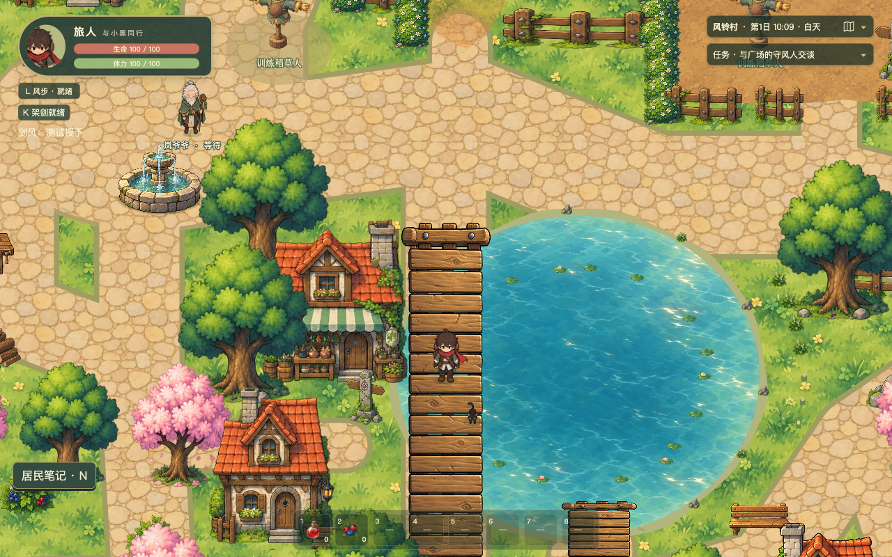

# 5173 动态水景可读性复核

5173 已接入新水效，不是服务仍运行旧项目。本次确认监听进程26705的工作目录为当前farwind，HTTP返回了WaterEffects创建与更新代码，所有水效素材均200且使用no-cache。未能读取用户现有Chrome标签页，因此没有把该标签页缓存旧代码认定为事实。

首轮验收的不足在于效果太克制：原池塘中心相隔2.3秒平均通道差仅0.17，原测试只要求少量像素变化。它能证明动画运行，不能证明默认缩放下容易看出。首轮最终检查使用5221副本，也没有把用户正在使用的5173作为最后验收入口。

另在本次检查期间，5173日志记录了17:13和17:15的居民/战斗源码改动触发整页重载，实际检查页因此回到标题；标题、菜单、失焦和隐藏时水效按设计停止。这是实测的附加因素，并不代表用户原标签页一定处于同一状态。

## 本次改动

- `src/game/systems/waterMotion.ts`：仅增强显示参数。喷泉流速42→66源像素/秒、流层透明度0.64→0.90，适度增强落水、飞溅和扩散波纹；池塘笔触透明度0.42→0.78、局部位移5→8世界像素、周期9.6→7.2秒，反光0.45→0.85。保留同一批手绘图片、对象数量、石质主体、岸线、桥、碰撞与环境时钟。
- `tests/water-effects.spec.ts`：新增平均变化强度门槛（喷泉0.75、池塘0.35），保留原遮挡和行为断言；增加独立证据目录参数，避免覆盖首轮证据。
- `tools/playwright-water-effects.config.ts`：默认验证入口改为5173，避免默认指向已经停止的5192副本。
- `tools/verify-water-instance.mjs`：直接对5173保存正常HUD、默认缩放的四时刻截图和原始运行录屏，并排除石沿/桥面变化。不增加游戏调试入口，没有新占位素材。

## 实际结果

5173的4项水景专项全部通过。加强可见性断言后单独复核1项通过；两种默认视口录屏的6组采样也通过更严格门槛。局部平均通道差本轮为喷泉约1.04至1.87、池塘约0.54至0.90，石质前池沿与桥面变化始终为0。数字只证明真实局部变化及遮挡，观感以以下正常HUD录屏复核。

[1280×800默认视口录屏](1280x800-dpr1.mp4) · [1920×1080、DPR1.5默认视口录屏](1920x1080-dpr1.5.mp4)

录屏只按时间裁去初始化菜单，没有补画、插帧或改变游戏像素；没有采用2倍近景作为可读性依据。原始相位、像素采样及错误记录见`default-view-results.json`。

类型检查、5项水效逻辑测试和生产构建通过。本轮全量单测已结束，441通过、1失败；失败为`tests/day-night.test.ts:64`的居民出口分离断言，实际距离0，本次没有修改该断言或居民实现。完整汇总见`verification.json`。未再次运行首轮145项全库浏览器回归，也未重复长期性能检查，不能宣称整个游戏全部验证通过。

VERDICT: PASS（仅本次水效增强）。P0/P1 BLOCKERS：无。UNVERIFIED RISKS：既有Chrome标签页的加载状态未直接读取，居民单测失败尚未由本任务修复，长期性能未复测。NON-BLOCKING FINDINGS：默认视口可读性必须继续依靠实际运行观察，不能只采用低阈值像素差异。
